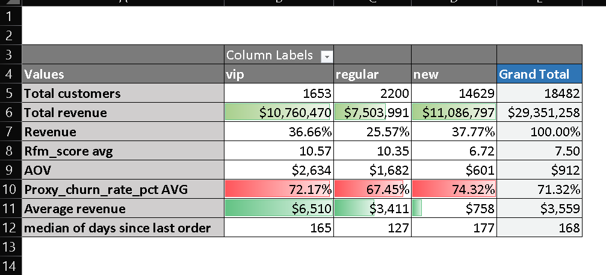

# 04 · Excel Report

`python_analysis_report.xlsx` presents the Python outputs through PivotTables, filters and charts. It is a business-friendly version of the analysis for someone who does not need to open the notebooks.

## Sheets

| Sheet | Content |
|---|---|
| `01.customers_summary` | Customer segment metrics, revenue share, AOV and proxy churn rate |
| `02.products_summary` | Category metrics, estimated margin/profit and top products |
| `03.monthly_sales_trend` | Monthly sales, MoM growth and rolling averages |
| `04.cohort_sizes` | Monthly customer cohorts and chart |

Hidden sheets contain the detailed CSV exports used by the report.

## Source

The report is built from the CSV outputs in [`../03_python_analysis/output`](../03_python_analysis/output).

## Note

The product and customer reports use slightly different row filters, so their total revenue figures can differ slightly.
