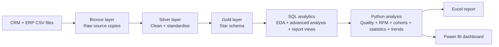
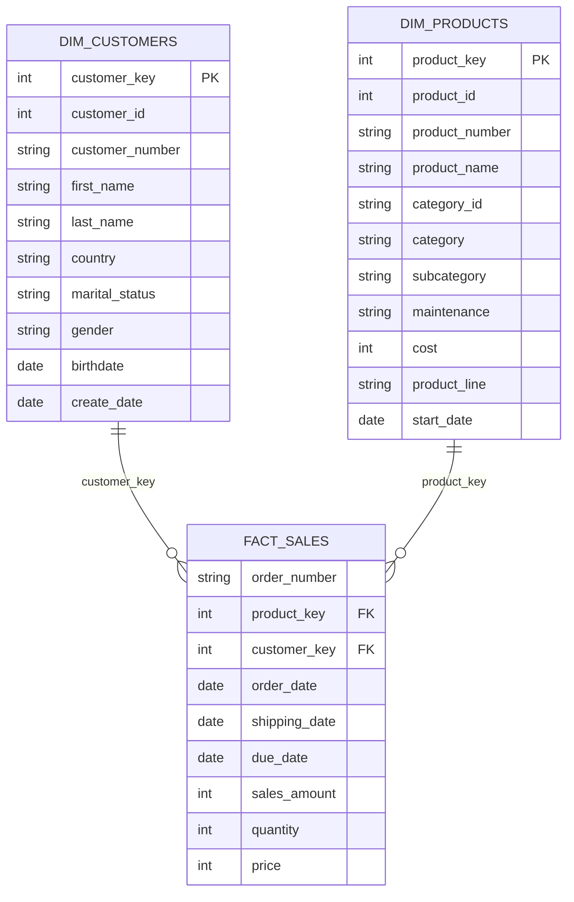
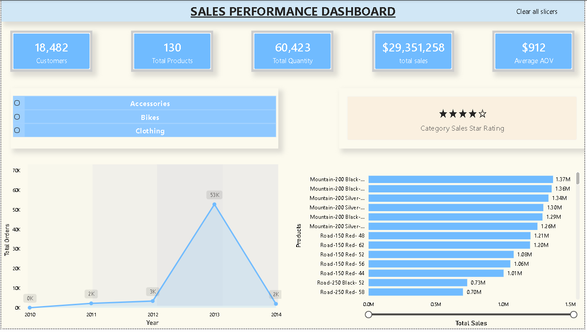
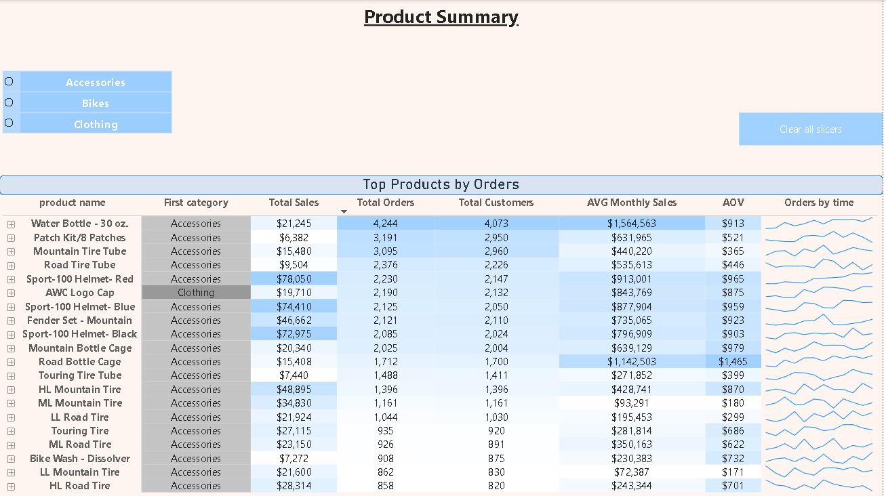

# Retail Sales Analytics — SQL Server, Python, Excel & Power BI

An end-to-end retail analytics project built around CRM and ERP sales data. The workflow starts with a SQL Server Bronze → Silver → Gold warehouse, moves into analytical SQL and Python, then packages the findings in Excel and Power BI.

The repository is deliberately split into clear stages so the data flow and reasoning can be followed without opening every file at once.

## At a glance

| | |
|---|---|
| Business | Bike retailer selling Bikes, Accessories and Clothing |
| Period covered | December 2010 to January 2014 |
| Size | 18,482 customers · 130 products · 27,657 orders · 60,398 sales rows |
| Revenue | 29.35 million |
| Average order value | 1,061 |

## Project flow

| Step | Folder | Main work |
|---|---|---|
| 1 | [`01_sql_data_warehouse`](01_sql_data_warehouse) | Bronze, Silver and Gold warehouse layers |
| 2 | [`02_sql_analytics`](02_sql_analytics) | EDA, advanced SQL analysis and report views |
| 3 | [`03_python_analysis`](03_python_analysis) | Data quality, RFM, cohort retention, profitability, churn proxy, statistics, trend and forecast baseline |
| 4 | [`04_excel_report`](04_excel_report) | Python findings presented through PivotTables and charts |
| 5 | [`05_power_bi_dashboard`](05_power_bi_dashboard) | Final sales and product-performance dashboard |

## Architecture



Source file: [`docs/architecture.mmd`](docs/architecture.mmd)

## Gold-layer ERD



Source file: [`docs/gold_erd.mmd`](docs/gold_erd.mmd)

## Dashboard preview





## Key findings

- **Revenue is concentrated in bikes.** Bikes bring 96.5% of revenue; Accessories 2.4% and Clothing 1.2%. Accessories have the highest estimated margin (62.8%), but their revenue is small.
- **A few products carry the catalogue.** 35 of the 130 products (26.9%) generate at least 80% of revenue.
- **Two RFM segments drive revenue.** Champions and at-risk high-value customers are 45.6% of customers and about 96% of revenue.
- **Repeat purchases are rare.** Customers place 1.5 orders on average, and the median cohort retention is 0% for months 1 to 9.
- **VIP customers are few but valuable.** 1,653 VIP customers (8.9%) generate 36.7% of revenue.
- **Sales grew over the period, with a dip in early 2012.** Monthly sales reached about 1.87 million in December 2013 before the partial January 2014 month.

## Business recommendations

- **Retention:** customers place 1.5 orders on average and median retention is 0% for the first 9 months. A follow-up offer after the first purchase is the biggest opportunity.
- **Win-back:** 4,724 "at risk - high value" customers bring 49.4% of revenue and last ordered about 320 days ago on average. Target them first.
- **Bike concentration:** bikes are 96.5% of revenue. Accessories have the best estimated margin (62.8%) but only 2.4% of revenue, so bundling them with bike sales is worth testing.
- **VIP customers:** 1,653 customers (8.9%) generate 36.7% of revenue. A loyalty programme for them protects a large share of sales.

## Documentation

- [`docs/data_dictionary.md`](docs/data_dictionary.md) — Gold tables plus downstream report views
- [`docs/reproducibility_notes.md`](docs/reproducibility_notes.md) — fixed-reference-date limitation and why it was not silently changed

## Repository structure

```text
.
├── 01_sql_data_warehouse/
│   ├── datasets/
│   │   ├── source_crm/
│   │   └── source_erp/
│   ├── scripts/
│   │   ├── init_database.sql
│   │   ├── bronze/        (ddl_bronze.sql, proc_load_bronze.sql)
│   │   ├── silver/        (ddl_silver.sql, proc_load_silver.sql)
│   │   └── gold/          (ddl_gold.sql)
│   └── tests/             (quality_checks_silver.sql, quality_checks_gold.sql)
├── 02_sql_analytics/      (01–11 analysis queries, 12–13 report views)
├── 03_python_analysis/
│   ├── *.ipynb            (notebooks 01–09)
│   ├── config.py
│   └── output/            (CSVs and charts)
├── 04_excel_report/
├── 05_power_bi_dashboard/
├── docs/
└── README.md
```

## Reproduce

### 1. Build the warehouse (SQL Server)

You need SQL Server or SQL Server Express and SSMS. Run the scripts in this order, all inside `01_sql_data_warehouse/scripts/`:

| Step | Script | What it does |
|---|---|---|
| 1 | [`init_database.sql`](01_sql_data_warehouse/scripts/init_database.sql) | Creates the `DataWarehouse` database and the `bronze`, `silver`, `gold` schemas. It drops the database if it already exists. |
| 2 | [`bronze/ddl_bronze.sql`](01_sql_data_warehouse/scripts/bronze/ddl_bronze.sql) | Creates the Bronze tables. |
| 3 | [`bronze/proc_load_bronze.sql`](01_sql_data_warehouse/scripts/bronze/proc_load_bronze.sql) | Creates the loader procedure. **First change the six `C:\sql\dwh_project\datasets\...` paths to where the `datasets/` folder is on your machine**, then run `EXEC bronze.load_bronze;` |
| 4 | [`silver/ddl_silver.sql`](01_sql_data_warehouse/scripts/silver/ddl_silver.sql) | Creates the Silver tables. |
| 5 | [`silver/proc_load_silver.sql`](01_sql_data_warehouse/scripts/silver/proc_load_silver.sql) | Creates the cleaning procedure. Run `EXEC silver.load_silver;` |
| 6 | [`gold/ddl_gold.sql`](01_sql_data_warehouse/scripts/gold/ddl_gold.sql) | Creates `gold.dim_customers`, `gold.dim_products` and `gold.fact_sales`. |

Optional: run the checks in [`tests/`](01_sql_data_warehouse/tests) to validate Silver and Gold.

### 2. SQL analytics

Connect to the `DataWarehouse` database and run the queries in [`02_sql_analytics`](02_sql_analytics):

- `01` to `11` are exploration and analysis queries and can be run in any order.
- `12_report_customers.sql` and `13_report_products.sql` create `gold.report_customers` and `gold.report_products`. **Run these two before the Python notebooks**, because the notebooks read from them.
- `00_init_database.sql` is not needed for this workflow. It creates a separate `DataWarehouseAnalytics` database that expects gold CSV files which are not included here.

### 3. Python

```bash
pip install -r 03_python_analysis/requirements.txt
```

Set your SQL Server instance in [`03_python_analysis/config.py`](03_python_analysis/config.py) (default is `.\SQLEXPRESS` with Windows authentication and ODBC Driver 17), then run notebooks 01 to 09 in order.

### 4. Excel and Power BI

The workbook and the `.pbix` file are included. They read the CSV files in `03_python_analysis/output`, so you do not need SQL Server just to open them.

## Important analytical notes

- The data ends on 28 January 2014. January 2014 is partial, so its MoM decline should not be interpreted as a real business collapse.
- The SQL report views use `GETDATE()` for customer age and recency, so those values depend on the day the view is queried. See [`docs/reproducibility_notes.md`](docs/reproducibility_notes.md).
- Python's churn analysis is a 90-day inactivity proxy, not a trained churn model.
- Profitability uses an estimated margin from sales and product cost; discounts, freight and overhead are not modelled.

## Acknowledgements

The sample CRM/ERP data and the Bronze / Silver / Gold warehouse pattern are based on the open-source [SQL Data Warehouse Project](https://github.com/DataWithBaraa/sql-data-warehouse-project) by Data With Baraa (MIT License). SQL Analitics, The Python analysis, Excel report and Power BI dashboard are my own work.

## Author

Shakti — Jaipur, India.
