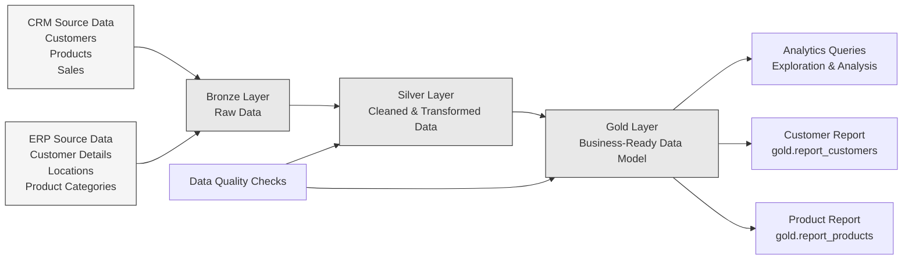

# SQL Data Warehouse & Analytics Project

## Overview

This project is a **SQL Server Data Analytics project** built around a layered data warehouse architecture.

The project takes raw CRM and ERP datasets through a structured **Bronze → Silver → Gold** data flow:

- **Bronze** – Raw source data loaded into SQL Server with minimal transformation.
- **Silver** – Data cleaning, standardization, validation, and transformation.
- **Gold** – Business-ready dimensional and fact views designed for analytics and reporting.
- **Analytics** – SQL analysis queries used to explore the data, identify trends, rankings, performance, segmentation, and other business insights.

The main goal of the project is to demonstrate how raw business data can be transformed into a clean, structured, and analytics-ready data model using SQL Server.

---

## Project Architecture



For a detailed version of the project structure, see [`project_architecture.mmd`](project_architecture.mmd).

---

## Repository Structure

```text
01_sql_data_warehouse/
│
├── datasets/
│   ├── source_crm/
│   │   ├── cust_info.csv
│   │   ├── prd_info.csv
│   │   └── sales_details.csv
│   │
│   └── source_erp/
│       ├── CUST_AZ12.csv
│       ├── LOC_A101.csv
│       └── PX_CAT_G1V2.csv
│
├── scripts/
│   ├── init_database.sql
│   │
│   ├── bronze/
│   │   ├── ddl_bronze.sql
│   │   └── proc_load_bronze.sql
│   │
│   ├── silver/
│   │   ├── ddl_silver.sql
│   │   └── proc_load_silver.sql
│   │
│   └── gold/
│       └── ddl_gold.sql
│
└── tests/
    ├── quality_checks_silver.sql
    └── quality_checks_gold.sql


02_sql_analytics/
│
├── 00_init_database.sql
├── 01_database_exploration.sql
├── 02_dimensions_exploration.sql
├── 03_date_range_exploration.sql
├── 04_measures_exploration.sql
├── 05_magnitude_analysis.sql
├── 06_ranking_analysis.sql
├── 07_change_over_time_analysis.sql
├── 08_cumulative_analysis.sql
├── 09_performance_analysis.sql
├── 10_data_segmentation.sql
├── 11_part_to_whole_analysis.sql
├── 12_report_customers.sql
└── 13_report_products.sql
```

---

## Data Sources

The project uses two main source systems.

### CRM

The CRM source contains:

- Customer information
- Product information
- Sales transaction details

### ERP

The ERP source contains:

- Additional customer details
- Customer location information
- Product category information

These sources are loaded into the warehouse and integrated through the Silver and Gold layers.

---

## Data Warehouse Layers

### 1. Bronze Layer

The Bronze layer stores the source data in SQL Server with a structure that closely follows the original datasets.

Bronze tables include:

- `bronze.crm_cust_info`
- `bronze.crm_prd_info`
- `bronze.crm_sales_details`
- `bronze.erp_cust_az12`
- `bronze.erp_loc_a101`
- `bronze.erp_px_cat_g1v2`

The Bronze loading procedure handles loading the source files into these tables.

---

### 2. Silver Layer

The Silver layer is responsible for preparing the raw data for analytics.

The transformation work includes activities such as:

- Removing unwanted spaces and formatting inconsistencies
- Handling missing and invalid values
- Standardizing categorical values
- Removing duplicate customer records using ranking logic
- Converting date fields into usable date values
- Validating sales values
- Standardizing product and customer attributes
- Preparing consistent keys for integration between CRM and ERP data

Silver tables include:

- `silver.crm_cust_info`
- `silver.crm_prd_info`
- `silver.crm_sales_details`
- `silver.erp_cust_az12`
- `silver.erp_loc_a101`
- `silver.erp_px_cat_g1v2`

---

### 3. Gold Layer

The Gold layer contains business-ready views that combine and organize the cleaned Silver data.

The model follows a dimensional structure with customer and product dimensions connected to sales transactions.

#### Customer Dimension

`gold.dim_customers`

Contains customer-level attributes such as:

- Customer ID
- Customer number
- Name
- Country
- Marital status
- Gender
- Birthdate
- Creation date

#### Product Dimension

`gold.dim_products`

Contains product-level attributes such as:

- Product ID
- Product number
- Product name
- Category
- Subcategory
- Maintenance
- Cost
- Product line
- Start date

#### Sales Fact

`gold.fact_sales`

Contains sales transaction information such as:

- Order number
- Product key
- Customer key
- Order date
- Shipping date
- Due date
- Sales amount
- Quantity
- Price

---

## Analytics

The `02_sql_analytics` directory contains SQL queries focused on different types of business analysis.

### Exploration

- Database structure exploration
- Dimension exploration
- Date-range analysis
- Measure exploration

### Business Analysis

- Magnitude analysis
- Ranking analysis
- Change-over-time analysis
- Cumulative analysis
- Performance analysis
- Data segmentation
- Part-to-whole analysis

### Reporting

Two business-oriented report views are also created:

#### Customer Report

`gold.report_customers`

Provides customer-level metrics and classifications including:

- Customer age and age group
- Customer segment
- Recency
- Total orders
- Total sales
- Total quantity
- Total products
- Customer lifespan
- Average order value
- Average monthly spend

#### Product Report

`gold.report_products`

Provides product-level metrics including:

- Product category and subcategory
- Product segment
- Recency
- Lifespan
- Total orders
- Total sales
- Total quantity
- Total customers
- Average selling price
- Average order revenue
- Average monthly revenue

---

## Data Quality

Data quality checks are included for both the Silver and Gold layers.

```text
tests/
├── quality_checks_silver.sql
└── quality_checks_gold.sql
```

These scripts are used to validate the transformed and business-ready data before relying on it for analytics.

---

## SQL Skills Demonstrated

This project demonstrates practical use of SQL Server for:

- Database and schema creation
- DDL and table design
- Stored procedures
- Data loading
- Data cleaning and transformation
- CTEs
- Window functions
- `ROW_NUMBER()`
- `LEAD()`
- Conditional logic with `CASE`
- Joins
- Aggregations
- Date calculations
- Data validation
- Dimensional modeling
- Fact and dimension views
- Business reporting
- Analytical SQL queries

---

## Tools & Technologies

- **SQL Server**
- **SQL Server Management Studio (SSMS)**
- **T-SQL**
- **CSV datasets**
- **Git / GitHub**

---

## Project Flow

```text
Raw CRM & ERP CSV Files
          │
          ▼
     Bronze Layer
   Raw Source Data
          │
          ▼
     Silver Layer
Cleaned & Transformed Data
          │
          ▼
       Gold Layer
 Business-Ready Data Model
          │
          ├──────────────► Customer Report
          │
          ├──────────────► Product Report
          │
          ▼
   Analytics Queries
          │
          ▼
Business Insights
```

---

## How to run

Run the scripts in `scripts/` in this order: `init_database.sql`, `bronze/ddl_bronze.sql`, `bronze/proc_load_bronze.sql` (edit the CSV paths first, then `EXEC bronze.load_bronze;`), `silver/ddl_silver.sql`, `silver/proc_load_silver.sql` (then `EXEC silver.load_silver;`) and finally `gold/ddl_gold.sql`. The full walkthrough is in the [main README](../README.md#reproduce).

---

## Acknowledgements

The source CSV files in `datasets/` are from the [SQL Data Warehouse Project](https://github.com/DataWithBaraa/sql-data-warehouse-project) by Data With Baraa (MIT License).

---

## Key Objective

The project demonstrates an end-to-end SQL-based analytics workflow:

**Raw Data → Data Warehouse → Data Cleaning → Data Transformation → Dimensional Model → Analytics & Reporting**

It is designed to show practical data analytics skills rather than only individual SQL queries.
